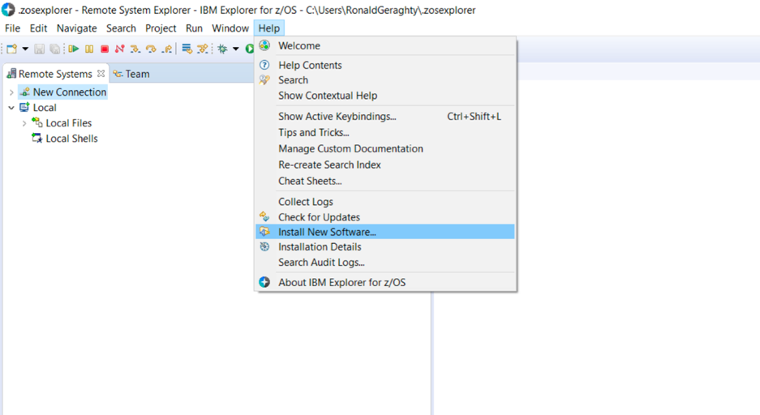
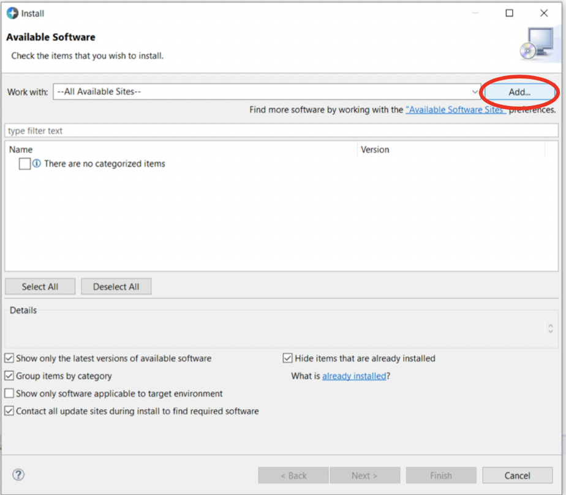
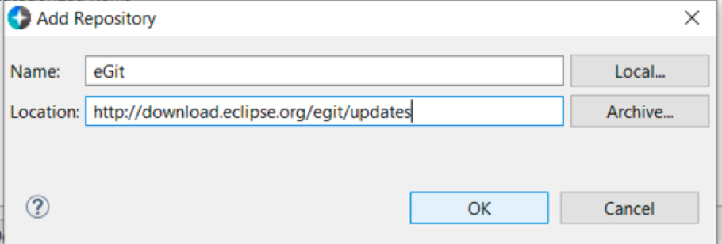

# Egit-Intallation for IBM Explorer for z/OS 

1. Open IBM Explorer for z/OS. 
2. Click on **Help** -> **Install New Software...** 
3. Click the **Add** Button. 
4. Type "eGit" for **Name** and "http://download.eclipse.org/egit/updates" for **Location**. Then click **OK**. 
