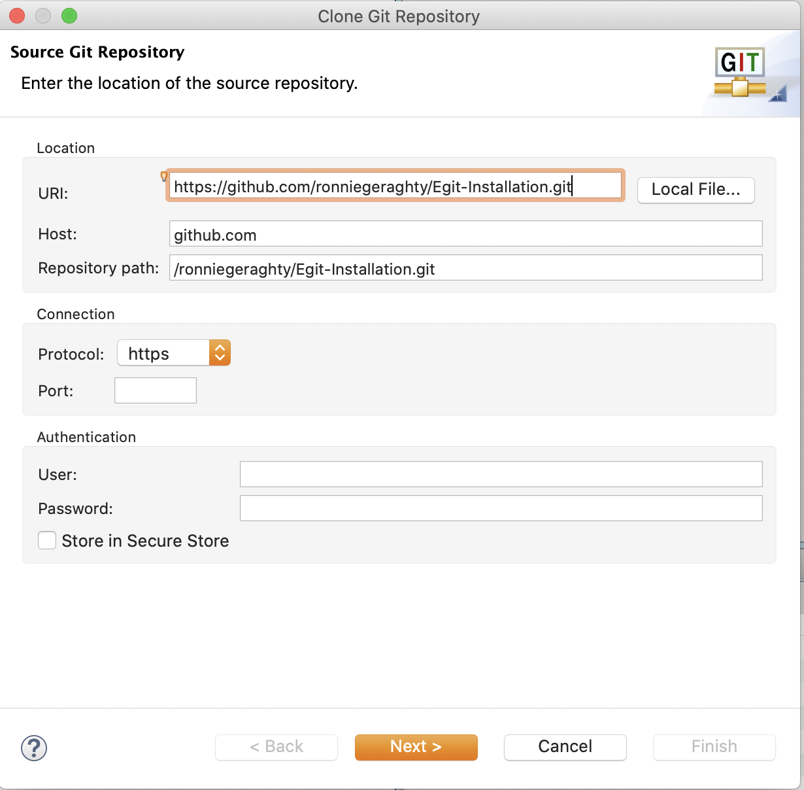
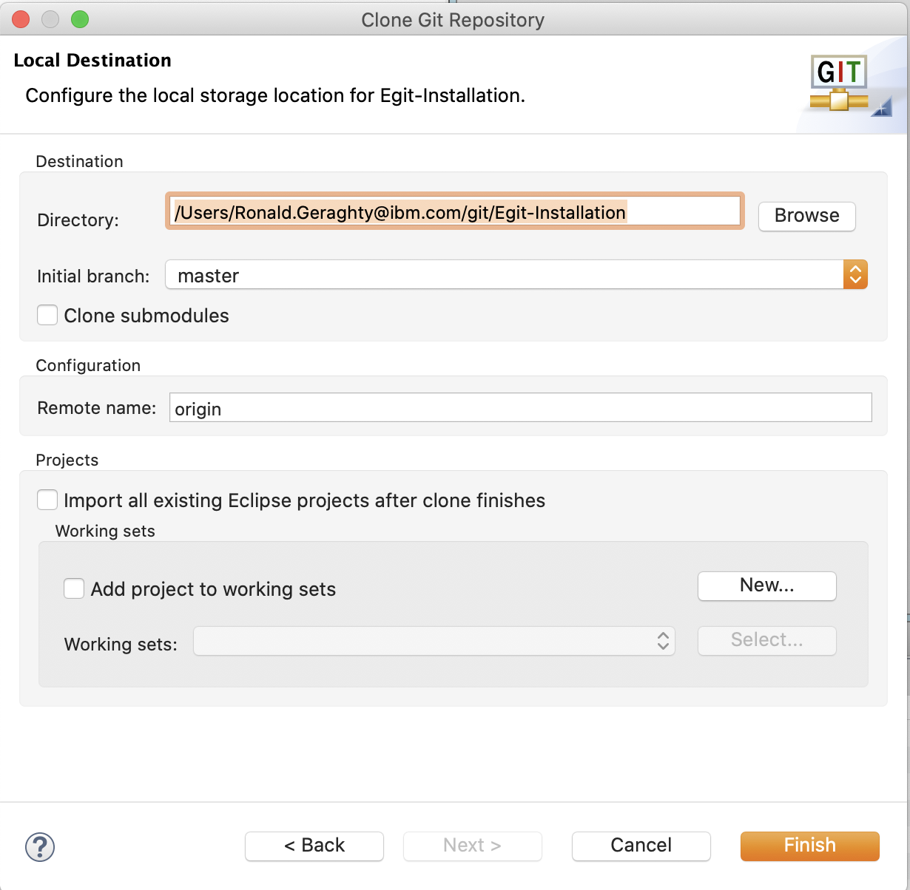

# Egit-Intallation for IBM Explorer for z/OS <!-- omit in toc -->

This code pattern goes through the process of installing the Egit plug-in to IBM Explorer for z/OS Aqua. It also shows how to work with the plug-in to create a new git repository, adding an existing git repository, cloning a git repository from a remote host, and how to commit and push to a git repository. 

This work is being done as a series of code patterns around bringing DevOps practices to z/OS Connect projects. 

### Sections: <!-- omit in toc -->
- [1. Installing the eGit Plug-in](#1-installing-the-egit-plug-in)
- [2. Creating a Git Repo with eGit](#2-creating-a-git-repo-with-egit)
- [3. Creating a Repo from an Existing Project](#3-creating-a-repo-from-an-existing-project)
- [4. Clone a Git Repository](#4-clone-a-git-repository)

## 1. Installing the eGit Plug-in

**1.1** Open IBM Explorer for z/OS. 

**1.2** Click on **Help** -> **Install New Software...** 

**1.3** Click the **Add** Button. 

**1.4** Type "eGit" for **Name** and "http://download.eclipse.org/egit/updates" for **Location**. Then click **OK**. 

**1.5** Click the check box next to **Git integration for Eclipse**. Also, click the check box next to **Show only software applicable to target environment**. Then click **Next**. 

**1.6** Click the **Next** Button. 

**1.7** Click the **Next** Button. 

**1.8**  Click the radio button to accept the terms of the license agreements, then click **Finish**. 

**1.9**  A window will pop up during the install. Make sure the check box next to **Eclicpse Foundation\, Inc; Java Software...** is checked. Then click **OK**.  

**1.10**  Once the plug-in is finished installing IBM Explorer for z/OS will need to be restarted before it can be used. A pop-up window should appear asking you to restart. Click **Yes**.

## 2. Creating a Git Repo with eGit

**2.1**  Reopen IBM Explorer for z/OS if it did not repoen automatically. 

**2.2**  Click on **Window** -> **Perspective** -> **Open Perspective** -> **Other...**. 

**2.3**  Select **Git** and click **OK**.   

**2.4**  Select **Create new local Git repository** 

**2.5**  Select the Directory you wish to create a git repository for. Then click **Create**. 

**2.6** See that the repository now shows up in the **Git Repositories** view. 

## 3. Creating a Repo from an Existing Project

**3.1**  Open a Project in the **Project Explorer**. 

**3.2**  Right click on the Project. Then click **Team** -> **Share Project...** 

**3.3**   Select **Git**, then click **Next**. 

**3.4**  Click the **Create** Button. 

**3.5**  Choose the directory for your repository, then click **Finish**. 

**3.6**  Click **Finish**. 

**3.7**  The repository is now created. If you follow the sets in sections 2.2 & 2.3 to open the Git Perspective, you can see the newly created repo. 

## 4. Clone a Git Repository

**4.1** Click the **Clone a Git repository** link or the Clone icon at the top. 

**4.2** Enter the information of the repository you wish to clone. As you enter the **URI** the **Host** and **Repository Path** should fill themselves out. If not port is specified the default port will be used and if no User ID and Password are provided it will assume there is no authetication needed. Then click **Next >**.  

**4.3** Select the Branches you wish to clone then click **Next >**. 

**4.4** Enter the location on you machine to which you would like to save the cloned repository. Then click **Finish**. 

**4.5** Now your cloned repository should show up in the Git Perspective of z/OS Explorer. 