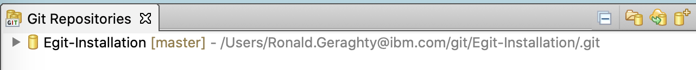
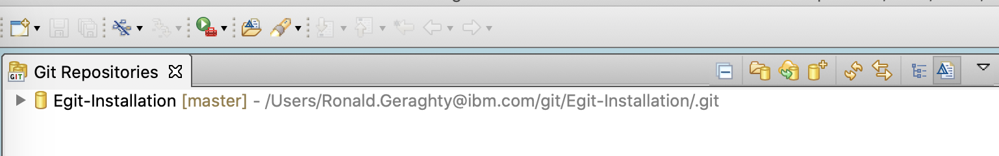

# EGit Installation for IBM Explorer for z/OS <!-- omit in toc -->

This code pattern walks through the process of installing the EGit plug-in to IBM Explorer for z/OS (z/OS Explorer). It then shows how to work with the plug-in to perform some standard tasks related to source code management with Git such as creating a new Git repository, adding an existing Git repository, cloning a Git repository from a remote host, and committing and pushing to a Git repository.

This work is being done as part of a series of code patterns centered on bringing DevOps practices to z/OS Connect projects.

### Prerequisites:

- IBM Explorer for z/OS must be installed. If it is not installed please reference this guide on doing so: [Installing IBM Explorer for z/OS Aqua](https://www.ibm.com/support/knowledgecenter/en/SSBDYH_3.2/com.ibm.zexpl.install.client.doc/topics/install20.html)
- Basic knowledge of the git source code manager tool.

### Sections: <!-- omit in toc -->

- [1. Installing the EGit Plug-in](#1-installing-the-egit-plug-in)
- [2. Creating a Git Repo with EGit](#2-creating-a-git-repo-with-egit)
- [3. Creating a Repo from an Existing Project](#3-creating-a-repo-from-an-existing-project)
- [4. Clone a Git Repository](#4-clone-a-git-repository)
- [5. Working with EGit](#5-working-with-egit)

## 1. Installing the EGit Plug-in

**1.1** Open IBM Explorer for z/OS. 

**1.2** Click on **Help** -> **Install New Software...** 

**1.3** Click the **Add** Button. 

**1.4** Type **"eGit"** for **Name** and "http://download.eclipse.org/egit/updates" for **Location**. Then click **OK**. 

**1.5** Click the check box next to **Git integration for Eclipse**. Also, click the check box next to **Show only software applicable to target environment**. Then click **Next**. 

**1.6** Click the **Next** Button. 

**1.7** Click the **Next** Button. 

**1.8** Click the radio button to accept the terms of the license agreements, then click **Finish**. 

**1.9** A window will pop up during the install. Make sure the check box next to **Eclipse Foundation\, Inc; Java Software...** is checked. Then click **OK**.  

**1.10** Once the plug-in is finished installing, IBM Explorer for z/OS will need to be restarted before it can be used. A pop-up window should appear asking you to restart. Click **Yes**.

## 2. Creating a Git Repo with EGit

**2.1** Re-open IBM Explorer for z/OS if it did not re-open automatically.

**2.2** Click on **Window** -> **Perspective** -> **Open Perspective** -> **Other...**. 

**2.3** Select **Git** and click **OK**.   

**2.4** Select **Create new local Git repository** 

**2.5** Select the Directory you wish the git repository to be saved in. _A sample path you can use is: **C:Users\<your-user-name>\git\repository**._ Then click **Create**. 

**2.6** See that the repository now shows up in the **Git Repositories** view. 

## 3. Creating a Repo from an Existing Project

**3.0** **Set Up:** Creating a Project Example.

- **3.0.1** Click **Window -> Perspecitve -> Open Perspective -> Other...**. Then select the **z/OS Projects** perspective, then click **OK**. (_If you don't have the z/OS Projects perspective available, then jump to step 3.0.2_) Right click in the z/OS Projects view, then click **New -> z/OS Project...**. Enter a name for the project in the **Project name:** field (for example: "ProjectExample"). Then select **Do not create a subproject now**, then click **Finish**.
- **3.0.2** Click **Window -> Perspecitve -> Open Perspective -> Other...**. Then select the **Resource** perspective, then click **OK**. Right click in the Project Explorer view, then click **New -> Project...**. Next, in the wizard select the dropdown next to the **General** folder, then select **Project**, and click **Next** at the bottom. Then type a project name in the **Project name:** field (for example: "ProjectExample"). Then click **Finish**.

**3.1** Open a Project in the **Project Explorer**. 

**3.2** Right click on the Project. Then click **Team** -> **Share Project...** 

**3.3** Select **Git**, then click **Next**. 

**3.4** Click the **Create** Button. If your project has already been initialized as a Git repository then this window won't show. You will be immediately taken to the next step. 

**3.5** Choose the directory for your repository, then click **Finish**. 

**3.6** Click **Finish**. 

**3.7** The repository is now created. If you follow the instructions in sections 2.2 & 2.3 to open the Git Perspective, you can see the newly created repo. 

## 4. Clone a Git Repository

**4.0 Set Up:** Create a GitHub account and Fork the repo.

- **4.0.1** Click this link: [GitHub SignUp](https://github.com/join?source=header), and create a GitHub account.
- **4.0.2** Now that you have your own GitHub account, click the **Fork** button at the top of this GitHub Repo.   _This will create a copy of this repository under your GitHub account._ 
- **4.0.3** Now for the rest of this code pattern you will be using the GitHub repositoy under your account.

**4.1** Click the **Clone a Git repository** link or the Clone icon at the top. 

**4.2** Enter the information of the repository you wish to clone. To find the URI for your newly forked repo, click the **Clone or download** button on your GitHub Repo Page.  Then click the **Copy** button next to the URL to copy it to your clipboard.     
Paste the URI into the **URI** field. As you enter the **URI** the **Host** and **Repository Path** should fill themselves out. If no port is specified the default port will be used. In the **Authentication** section enter your GitHub username in the **User:** field and you GitHub password in the **Password:** field. Then click **Next >**. 

**4.3** Select the Branches you wish to clone then click **Next >**. 

**4.4** Enter the location on you machine to which you would like to save the cloned repository. Then click **Finish**. 

**4.5** Now your cloned repository should show up in the Git Perspective of z/OS Explorer. 

## 5. Working with EGit

**5.1** Once your project has either been created, imported or cloned, you should now see it in the Git Perspective of z/OS Explorer. 

**5.2** Expand the Git Project by clicking the **>** to the left of the project. Then expand the **Working Tree** section. In this section you should see a **.git** folder, a **.project** file and the project folder itself. Expand the project folder to see all the files and folders in your project. Double click on any file to open it. 

**5.3** Make a change to the file you opened, then save the file. 

**5.4** Once you save the file, it should appear in the **Unstaged Changes** section at the bottom of the window. 

**5.5** Click the plus symbol to stage only the selected files or click the double plus symbol to stage all unstaged changes. 

**5.6** The file changes should now have moved to the **Staged Changes Section**. 

**5.7** In the **Commit Message** section, type a message that describes the changes you made. Then, click the **Commit** button if you would like to commit your changes to the local Git repository on you machine or the **Commit and Push...** button if you would like to commit the change to the local Git repository and push the commit to a remote repository. 

**5.8** If you are pushing to a remote repository, you may be asked to provide authentication. 

**5.9** You will then be shown the results of your commit and push. Click **Close** once you are done viewing the results. 

**5.10** If a remote is not already added to your Git project, you can add one by expanding the Git Project in the Git Perspective. Then right clicking the **Remote** section. The click **Create Remote...** 

**5.11** Enter a name for the remote repository then click **Create**. 

**5.12** Click on **Change...** 

**5.13** Enter the **URI** of your remote repository. As you enter the **URI** the **Host** and **Repository path** fields should fill themselves out. If the remote repository requires authentication also enter a **Username** and **Password**. The click **Finish**. 

**5.14** Now click **Save** to save the remote repository to your Git project. You can also click **Save and Push** to save the remote then push the project to the remote repository. 

**5.15** If you did not provide a username and password before and one is required, you may be asked again to provide one. 

**5.16** If you decided to push to the new remote, you will now see a results of the push. Click **Close** when you are finished looking through the push results. 
