# EGit Installation for IBM Explorer for z/OS <!-- omit in toc -->

### Introduction
This tutorial walks through the process of installing the EGit plug-in to IBM Explorer for z/OS (z/OS Explorer). It then shows how to work with the plug-in to perform some standard tasks related to source code management with Git such as creating a new Git repository, adding an existing Git repository, cloning a Git repository from a remote host, and committing and pushing to a Git repository.

This work is being done as part of a series of code patterns and tutorials centered on bringing DevOps practices to z/OS Connect projects.

### Prerequisites:
- IBM Explorer for z/OS must be installed. If it is not installed please reference this guide on doing so: [Installing IBM Explorer for z/OS Aqua](https://www.ibm.com/support/knowledgecenter/en/SSBDYH_3.2/com.ibm.zexpl.install.client.doc/topics/install20.html)
- Basic knowledge of Git.

### Estimated time
It should take approximately 30 minutes to complete this tutorial.

### Questions
If you have any questions, feel free to leave an Issue on this GitHub repository.

### Steps: <!-- omit in toc -->
- [1. Installing the EGit Plug-in](#1-installing-the-egit-plug-in)
- [2. Creating a Git Repo with EGit](#2-creating-a-git-repo-with-egit)
- [3. Creating a Repo from an Existing Project](#3-creating-a-repo-from-an-existing-project)
- [4. Clone a Git Repository](#4-clone-a-git-repository)
- [5. Working with EGit](#5-working-with-egit)

## 1. Installing the EGit Plug-in
Before we can interact with Git we need to install a plug-in into our z/OS Explorer environment.  This can be done with just a few clicks using the 'Install New Software' feature.

**1.1** Open IBM Explorer for z/OS. You should see an Eclipse application that looks something like this:
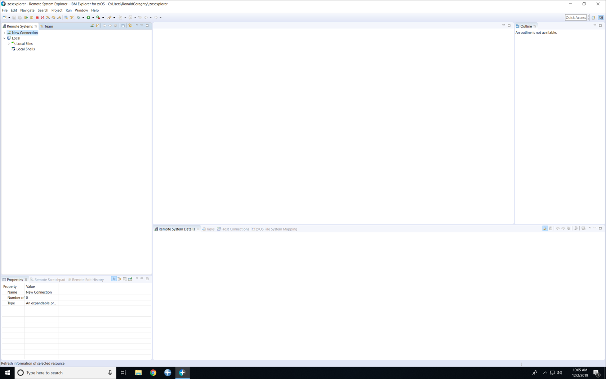

**1.2** Click on **Help** -> **Install New Software...**

**1.3** Click the **Add** Button.
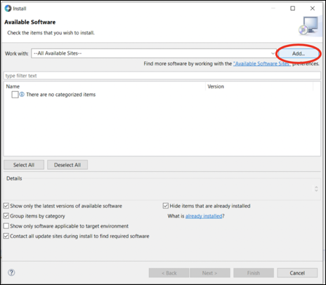

**1.4** Type **"eGit"** for **Name** and "http://download.eclipse.org/egit/updates" for **Location**. Then click **OK**.
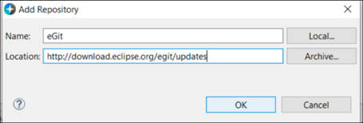

**1.5** Click the check box next to **Git integration for Eclipse**. Then below, click the check box next to **Show only software applicable to target environment**.  All the other checkboxes in the bottom section should have been checked by default. Then click **Next**. 

**1.6** Click the **Next** Button. 

**1.7** Click the **Next** Button. 

**1.8** Click the radio button to accept the terms of the license agreements, then click **Finish**. 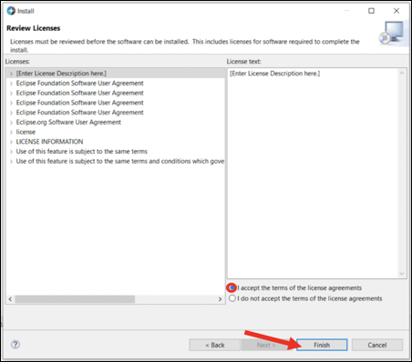

**1.9** A window will pop up during the install. Make sure the check box next to **Eclipse Foundation\, Inc; Java Software...** is checked. Then click **OK**.  

**1.10** Once the plug-in is finished installing, IBM Explorer for z/OS will need to be restarted before it can be used. Another pop-up window should appear asking you to restart. Click **Yes**.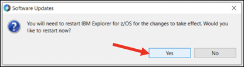

## 2. Creating a Git Repo with EGit
Now that our plug-in is installed, let's create a repository we can work with.  We'll start by creating a local repository on our PC where z/OS Explorer is running.

**2.1** Re-open IBM Explorer for z/OS if it did not re-open automatically.

**2.2** Click on **Window** -> **Perspective** -> **Open Perspective** -> **Other...**. 

**2.3** Select **Git** and click **OK**.   

**2.4** Select **Create new local Git repository** 

**2.5** Select the Directory you wish the Git repository to be saved in. _A sample path you can use is: **C:\Users\<your-user-name>\git\repository**._ Then click **Create**. 

**2.6** See that the repository now shows up in the **Git Repositories** view. 

**OPTIONAL 2.7** If you would like to remove the Git repository from the list follow these instructions.

- **2.7.1** Right click the repository you wish to remove. Then select **"Remove Repository from View"** in the drop down. A pop-up will appear asking if you would like to remove the projects in the Git repository from the workspace, if so click **Yes**, if not click **No**. Now the repository should be removed from the list.

**OPTIONAL 2.8** If you would like to delete the repository when we are done using it follow these instructions:

- **2.8.1** Right click the repository you wish to delete. Then select **"Delete Repository..."** in the drop down. A pop-up will appear with two checkboxes. If the first checkbox is checked it will delete the Git repository but not the actual project files. If both check boxes are checked it will delete the Git repository and the project files. Once you have selected the options to like, click **"Delete"**. The repository should now be deleted and removed from the list.

## 3. Creating a Repo from an Existing Project
Instead of starting with an empty repostiory, you might want to start a repository based on a project you already have in z/OS Explorer.  Follow these steps to do so:

**3.0** **Set Up:** Creating a Project Example.

- **3.0.1** Click **Window -> Perspective -> Open Perspective -> Other...**. Then select the **z/OS Projects** perspective, then click **OK**. (_If you don't have the z/OS Projects perspective available, then jump to step 3.0.2_) Right click in the z/OS Projects view, then click **New -> z/OS Project...**. Enter a name for the project in the **Project name:** field (for example: "ProjectExample"). Then select **Do not create a subproject now**, then click **Finish**. Now jump to step **3.1**.
- **3.0.2** Click **Window -> Perspective -> Open Perspective -> Other...**. Then select the **Resource** perspective, then click **OK**. Right click in the Project Explorer view, then click **New -> Project...**. Next, in the wizard select the dropdown next to the **General** folder, then select **Project**, and click **Next** at the bottom. Then type a project name in the **Project name:** field (for example: "ProjectExample"). Then click **Finish**.

**3.1** Find your project in the **Project Explorer**. 

**3.2** Right click on the Project. Then click **Team** -> **Share Project...** 

**3.3** Select **Git**, then click **Next**. 

**3.4** Click the **Create** Button. If your project has already been initialized as a Git repository then this window won't show. You will be immediately taken to the next step. 

**3.5** Choose the directory for your repository, then click **Finish**. 

**3.6** Click **Finish**. 

**3.7** The repository is now created. If you followed the instructions in sections 2.2 & 2.3 to open the Git Perspective, you can see the newly created repo. 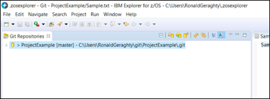

**OPTIONAL 3.8** Now that we are done creating a repository from an existing project, you may repeat step **2.7** or **2.8** if you wish to remove or delete the repository.

## 4. Clone a Git Repository
Cloning a repository will **copy** the repository from a hosted remote location, like GitHub, GitLab or Bitbucket. This will give you a copy of not only the source code but also a full copy of the history of the source code that has been recorded by Git._

**4.0 Set Up:** Create a GitHub account and Fork the repo.

- **4.0.1** If you don't already have a GitHub account, you can [create GitHub account here](https://github.com/join).

- **4.0.2** Now that you have your own GitHub account, click the **Fork** button at the top of the GitHub repo with the README you are reading now.   _This will create a copy of this repository under your GitHub account._ Note that the following screenshots show a different repo name than what you should be using in these steps. 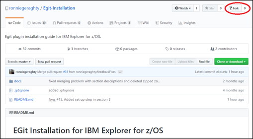

- **4.0.3** For the rest of these instructions you will be using the GitHub repository under your own account.

**4.1** Now back in IBM Explorer for z/OS, Click the **Clone a Git repository** link or the Clone icon at the top. 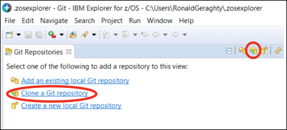

**4.2** Enter the information of the repository you wish to clone. To find the URI for your newly forked repo, click the **Clone or download** button on your GitHub Repo Page.  _(This button is located at the top of your GitHub Repository's page)_  
Then click the **Copy** button next to the URL to copy it to your clipboard.     
Paste the URI into the **URI** field. As you enter the **URI** the **Host** and **Repository Path** should fill themselves out. _(Note that in the your URI should follow this pattern: https://github.com/<your-github-username>/Egit-Installtion.git)_ If no port is specified the default port will be used. In the **Authentication** section enter your GitHub username in the **User:** field and you GitHub password in the **Password:** field. Then click **Next >**. 

**4.3** In this window you can select the branches to clone. We only need the **"master"** branch, so click the checkbox next to it then click **Next >**. _(Note: we will cover what a branch is in Section 5)_ 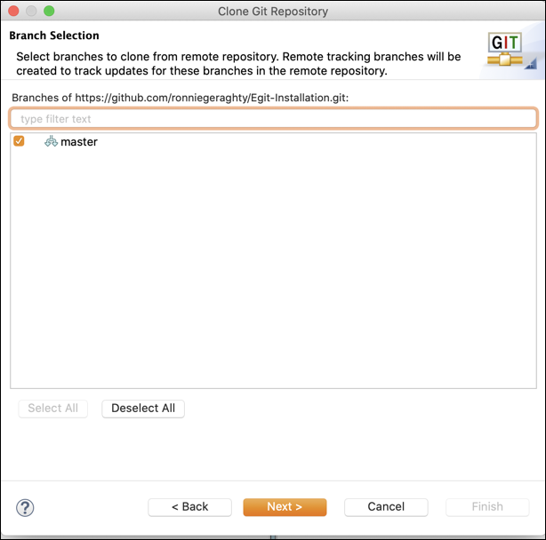

**4.4** Enter the location on your machine where you would like to save the cloned repository in the **"Directory"** field. Then click **Finish**. 

**4.5** Now your cloned repository should show up in the Git Perspective of z/OS Explorer. 

**4.6** Do not remove or delete the repository you just cloned. We will be using it in the next section.

## 5. Working with EGit
Working with Git repositories means understanding how code is organized.  Let's examine what a branch is in a Git repository, learn how to work with different branches, and why we would want to do so.

**5.0** Now that we have walked through the different ways of starting your Git project we will discuss how to work with your Git repository. For this section it would be best if you used the repository you forked and then cloned down in the previous steps.

**5.1** Once your project has either been created, imported or cloned, you should now see it in the Git Perspective of z/OS Explorer. 

**5.2** Expand the Git Project by clicking the arrow to the left of the project. From the drop down, expand the **Branches** section, then expand both the **Local** and **Remote**. This section shows you the different branches of your Git repository. A branch is an independent line of development, meaning you can make a branch off of the main line (your production source code) and work in that branch without effecting the main branch. This is how Git handles parallel development. Each developer can work in their own branch without having to worry about what another developer is doing. Then when you development branch is finished it can be incorporated back into the main branch. _Note: In Git the main branch is commonly named **master**._ The branches under the **Local** section are the branches that are available on your local machine. The branches under the **Remote** section are the branches that are available on the remote Git server (in our case this is GitHub).
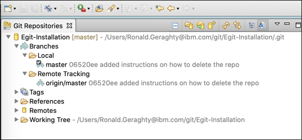

**5.3** Please note, in the **Local** section, the **master** branch has a check mark on it. This indicates that the **master** branch is currently checked-out, meaning when we look at the source code we are looking at the source code in the **master** branch.

**5.4** Now we will create our own branch to work in. Right click the Git repository at the top, then from the drop down select **Switch To**, and click **New Branch...**.

**5.5** In the pop-up window, enter **"development"** in the **Branch Name:** field. Make sure the **Check out new branch** option is selected. (This will switch us to the new branch or checkout the new branch in Git terms, once it is created.) Then click **Finish**.

**5.6** You should now see the **development** branch under the **Branches > Local** section. Also note how the check mark is now over the **development** branch, meaning that is the branch that is currently checked-out.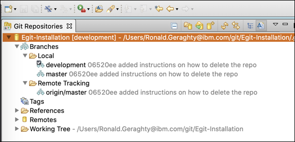

**5.7** Now that we have our own branch to work in let's make a change. Under our Git repository expand the **Working Tree** section. The **Working Tree** section holds our source code. _Note: the .git directory is a hidden directory where Git stores its information._ You should see a `sample.txt` file.

**5.8** Now double click the `sample.txt` file to open it. 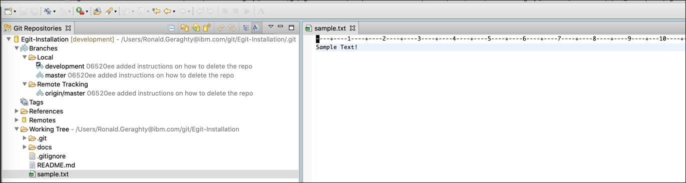

**5.9** Our change will just add a new line to the file. Once you've added a new line save the file with CTRL+S on Windows, CMD+S on Mac or click **File > Save**. 

**5.10** Once our file is saved, in the panel at the bottom of your screen, make sure the **Git Staging** view is selected. 

**5.11** Look at the **Unstaged Changes** section. You should see the `sample.txt` file we just changed. Unstaged changes are changes that are not going to be included in the next Git commit. A commit is like saving in Git terms. 

**5.12** Let's stage our change so it can be included in the next commit. We can stage the changes by selecting the change and clicking the green plus button. _Note: clicking the double green plus button will stage all unstaged changes._

**5.13** You should now see that the file has moved to the **Staged Changes** section. So now the change will be included when we commit our code. 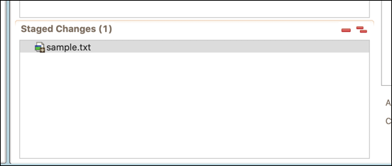

**5.14** Now let's commit our new change. In the **Commit Message** section write a commit that describes the change we made. 

**5.15** Now we can choose to either just **Commit** our changes or **Commit and Push** our changes. If we **Commit** our changes they will be saved to the branch we are working in (the **development** branch) on our local machine. If we **Commit and Push** then our changes will be saved to our branch locally and it will then push the local copy of our branch to GitHub. If there is already a **development** branch on GitHub our code will be added to that branch. If there is no **development** branch then a **development** branch will be created. Let's click the **Commit and Push...** button. 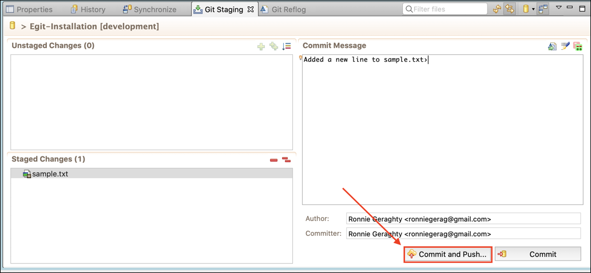

**5.16** A pop-up window should appear after clicking **Commit and Push...**. Leave all the defaults and click **Next**. 

**5.17** If prompted, enter in your GitHub username and password. Then click **OK**. 

**5.18** You should now see a pop-up like the one below. This pop-up is showing that our **development** branch will be push up to GitHub, and that this is a new branch on our GitHub repository. Click **Finish** to push the branch. If you are prompted for your username and password again, enter them then click **OK**. If not proceed to the next step. 

**5.19** You should now see a window that looks like the one below. This is confirming our branch was pushed up to GitHub. Click the **Close** button. 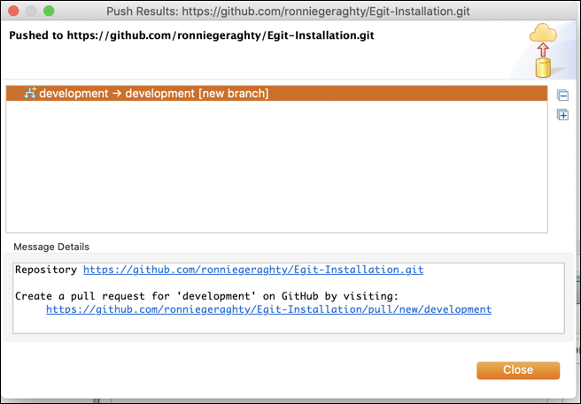

**5.20** Now, let's go back to GitHub to incorporate our **development** branch into our **master** branch. Back on our GitHub repo page, click the **Pull Requests** tab at the top. 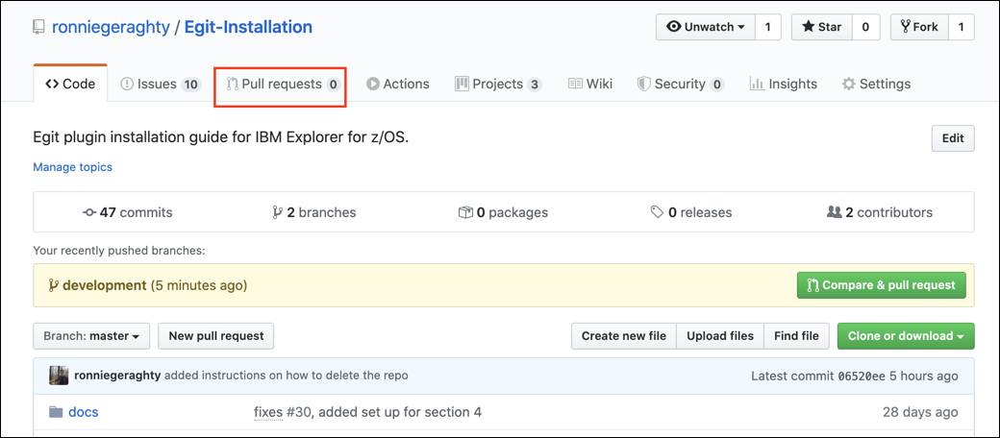

**5.21** Now click the **New Pull Request** button. 

**5.22** Under the **Comparing changes** title, see that there is a section that has one branch being merged into another. Change this so that the **master** branch is on the left, and our **development** branch appears on the right. 

**5.23** Now click the **Create Pull Request** button. _Note: if you look at the bottom of this page you can see the changes we are going to bring in to the **master** branch from our **development** branch._ 

**5.24** Now you can add a description about what changes are going to be brought into the **master** branch from our **development** branch. Then click the **Create Pull Request** button. 

**5.25** Now that once our pull request has been created other people can see the changes we would like to add to the **master** branch. Here we can also assign someone to review our request and we can merge our pull request. Let's merge our pull request so our changes are added to the **master** branch. Click the **Merge pull request** button. 

**5.26** Click the **Confirm merge** button. 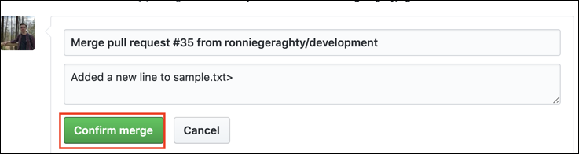

**5.27** You should now see a purple **Merged** icon on the screen.
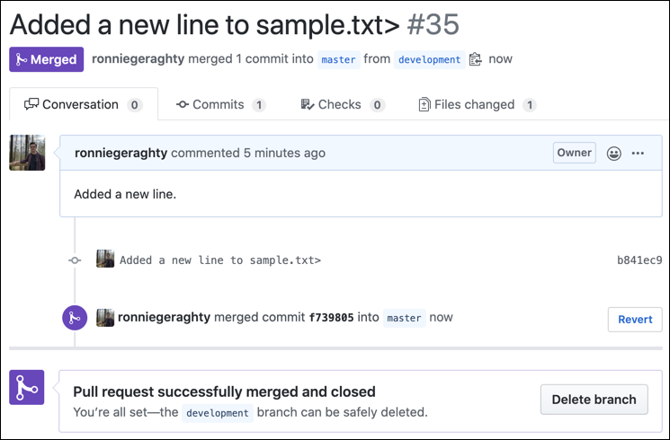

**5.28** Now our changes from our **development** branch have been incorporated into the **master** branch. If we click the **Code** tab at the top of the page we can view the source code. 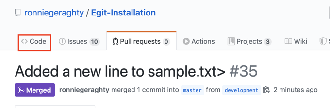

**5.29** Now we can see that the **master** branch is selected, let's click on the `sample.txt` file.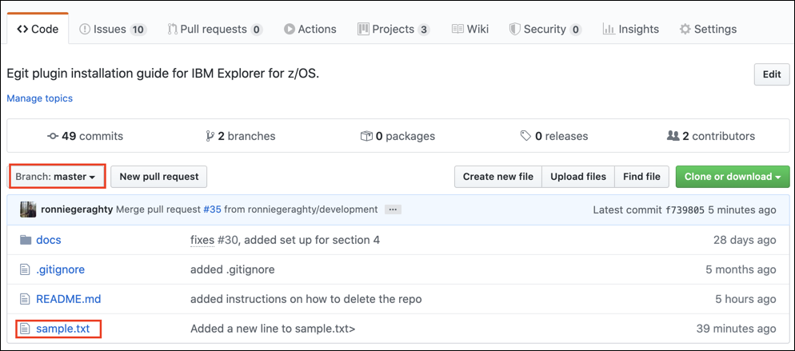

**5.30** Here we can see that our new line is added to the file on the **master** branch, so we have successfully incorporated our changes from our **development** branch into the **master** branch. 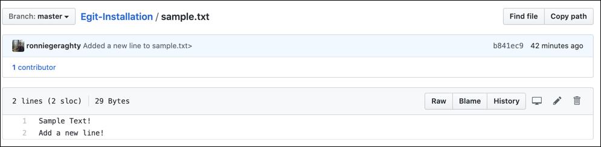

### Summary
This marks the end of this tutorial. Hopefully you've enjoyed installing and configuring the eGit plug-in to allow easy interaction between z/OS Explorer and Git.  You're now ready to use Git for all the source for your applications running on z/OS.  Go ahead and try to use it with your fist "real" project.

## Related links
- [IBM z/OS Explorer overview page](https://developer.ibm.com/mainframe/products/zosexplorer/)
- [z/OS Explorer Knowledge Center](https://www.ibm.com/support/knowledgecenter/SSBDYH/welcome.html)